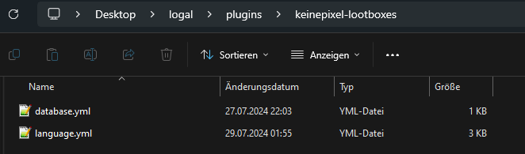

# keinepixels-lootboxes
Open source since 29th of July, 2024

**NOTE**: Default configuration files available [here](/default/)

### Introduction

This is a simple lootbox system for KeinePixel. It is a simple system that allows players to purchase
lootboxes and receive random items from them. The system is designed to be easy to use and modify, so you can customize
it to fit your game's needs.

### Features

- Players can open lootboxes and receive random items
- Items can have different rarities and drop rates
- Players can purchase lootboxes with in-game currency (soon™)
- Admins can create new lootboxes and add items ingame
- Admins can modify the "available date" of lootboxes (this means that lootboxes can be available only for a limited
  time and limited amount of times)
- Admins can modify the chance of getting an item from a lootbox

NOTE: Item rarities are not implemented yet, if they will be implemented in the future, the system will automatically
calculate the chance of getting an item based on its rarity.

### Installation

1. Download the latest release from
   the [releases page here.](https://github.com/keinepixelnet/keinepixels-lootboxes/releases)
2. Add the `keinepixel-lootboxes-1.0.jar` to your server's `plugins` folder
3. Start your server
4. The plugin will automatically create a `keinepixel-lootboxes` folder in your server's `plugins` folder.

This should look like this: **(Windows as an example)**


5. Stop your server
6. Open the `database.yml` file in the `keinepixel-lootboxes` folder
7. Configure the database settings
8. Start your server
9. The plugin will automatically create the necessary tables in your database
10. You're done! You can now start using the lootbox system.

### Commands

soon™

### Permissions

soon™

### Support

If you have any questions or need help with the plugin, feel free to join
our [Discord server]( https://discord.com/invite/DVj98QwMwQ/) and ask for help in the `#support` channel.

### FAQ

#### Why didn't you use the Bukkit Conversation API?

The Bukkit Conversation API is a bit outdated and not very user-friendly. I decided to use a custom system for the
plugin to make it easier to use and modify.
Also, the Bukkit Conversation API is shit. I tried sending a message before returning END_OF_CONVERSATION, it simply
just ignored that.

### License

```
Copyright (c) 2024, KeinePixel

Permission is hereby granted, free of charge, to any person 
obtaining a copy of this software and associated documentation 
files (the "Software"), to deal in the Software without 
restriction, including without limitation the rights to use, copy, 
modify, merge, publish, distribute, sublicense, and/or sell copies
 of the Software, and to permit persons to whom the Software is 
 furnished to do so, subject to the following conditions:

The above copyright notice and this permission notice shall be 
included in all copies or substantial portions of the Software.

THE SOFTWARE IS PROVIDED "AS IS", WITHOUT WARRANTY OF ANY KIND, 
EXPRESS OR IMPLIED, INCLUDING BUT NOT LIMITED TO THE WARRANTIES OF 
MERCHANTABILITY, FITNESS FOR A PARTICULAR PURPOSE AND 
NONINFRINGEMENT. IN NO EVENT SHALL THE AUTHORS OR COPYRIGHT HOLDERS 
BE LIABLE FOR ANY CLAIM, DAMAGES OR OTHER LIABILITY, WHETHER IN AN 
ACTION OF CONTRACT, TORT OR OTHERWISE, ARISING FROM, OUT OF OR IN 
CONNECTION WITH THE SOFTWARE OR THE USE OR OTHER DEALINGS IN THE 
SOFTWARE.
```

### Credits

- [KeinePixel](https://keinepixel.net) - for creating the plugin
- [SpigotMC](https://www.spigotmc.org/) - for providing the Spigot API
- [MongoDB](https://www.mongodb.com/) - for providing such beautiful database software
- [IntelliJ IDEA](https://www.jetbrains.com/idea/) - for providing the best IDE for Java development
- [GitHub](https://www.github.com/) - for providing a platform to host the source code
